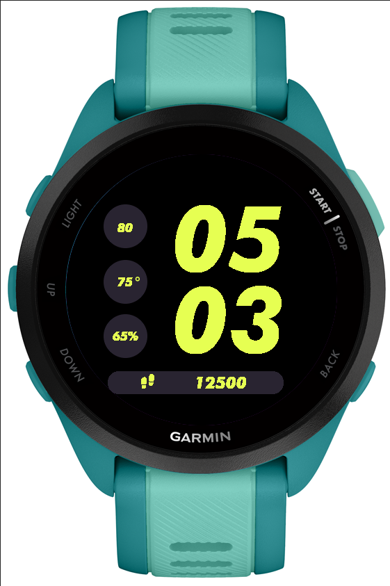

# **Runner Garmin Watchface Lite**

### **Description**
This is a Garmin Watchface I built using Monkey C. This watchface is inspired by the Nike watchfaces that are available on the Apple Watch. This is a stripped down version of my Minimal Garmin Watchface that removes on-device settings to make it more lightweight. 

I created this watchface to run on my Garmin Forerunner 165 Music (and I am currently using this watchface). The Forerunner 165 Music is the only Garmin watch I own, so it has only been tested on the Forerunner 165 Music model. 

### **Data Fields**
- Battery
- Temperature
- Heart Rate
- Weekly Running Distance (in miles)
- Steps 
> *Tap and hold on the watchface (touchscreen) to swap between weekly running distance and total daily steps underneath the time*